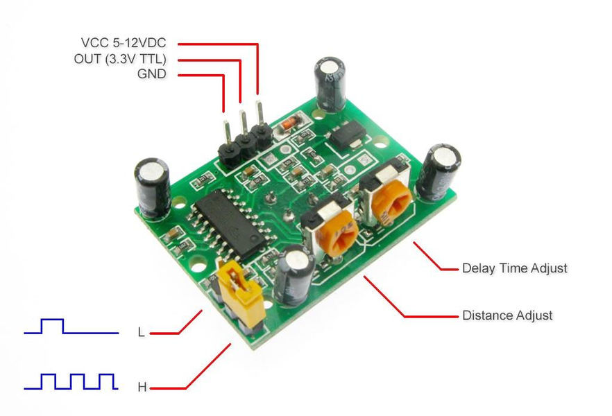

kitchen-auto-spotify
====================

I like music. I combine permanent looking for something new and laziness to select what I want to
listen right now 90% of time. I'm also too lazy to turn it on quite often.

Partially inspired by
[this Twitter thread (in Russian)](https://twitter.com/turbojedi/status/1104744361139544066), tho
this implementation is much simpler.

How does it work
----------------

Hardware is based on Raspberry Pi with atteched PIR sensor for movement detection (well,
_technically_ it's heat waves detection but it works ok with moving people). When a human is nearby
the sensor for configurable period of time, and if there are no other playing devices detected
through Spotify API, it checks Spotify featured categories, picks one of them randomly, picks one
playlist from that category randomly, starts playing it. If there is no motion detected for some
time period, it shuts up automatically. Spotify player is installed on the same Raspberry Pi which
is connected to the external sound speaker.

What do you need if you want to have it
---------------------------------------

* [Raspbery Pi](https://www.raspberrypi.org/) (I use RPi 3 Model B+);
* PIR sensor (e.g. [this one](https://www.sparkfun.com/products/13285) or any other compatible with
  your RPi, there is shitton of them available for mere $1-2 at Aliexpress);
* three F-to-F jump wires (a.k.a. DuPont wires);
* microSD card with Raspbian Lite installed;
* external sound speaker with AUX IN (I use some noname crap I found at the nearest offline stock);
* computer with microSD card reader and SSH client installed.

How to setup
------------

Assuming that you already have RPi with installed basic Raspbian Lite (tested only with Buster
a.k.a. Debian 10).

By default, it uses only Ethernet connection, if you want to mess with cables a bit less, you might
use [this guide](https://raspberrypihq.com/how-to-connect-your-raspberry-pi-to-wifi/) and connect
your RPi to your home WiFi network.

#### 1. Connect PIR sensor to RPI GPIO.

Use GPIO pins scheme from
[this guide](https://maker.pro/raspberry-pi/tutorial/how-to-interface-a-pir-motion-sensor-with-raspberry-pi-gpio)
as an example. I use the following pins in my current setup:

  * pin 2 (5V) to VCC (power);
  * pin 7 (GPIO4) to OUT (data);
  * pin 9 (GND) to GND (ground).

Remember which pin you used for data connection, it matters!

It's highly unrecommended to hot plug or unplug GPIO powered devices to RPi. Power it off before
doing that.



#### 2. Adjust PIR sensor.

I recommend to set measure delay to minimum (10 seconds) by setting delay adjuster to the most left
position (carefully rotate it counter clockwise). Ensure that trigger method is set to repeatable
mode (H).

#### 3. Install all necessary software.

[spotifyd](https://github.com/Spotifyd/spotifyd) binaries and configuration documentation can be
found in project repo.

The following Debian packages are needed:

```bash
apt install -y python3 python3-rpi.gpio python3-pip git
```

I also use [tmux](https://en.wikipedia.org/wiki/Tmux) as one of ways to run the script in foreground
but make it sustainable to SSH connections drops. One day I'll update this project to make it
runnable as system service. Or not.

#### 4. Create Spotify application and obtain its tokens.

1. Go to [applications dashboard](https://developer.spotify.com/dashboard/applications). Log in and
   create the application.
2. Press big "Create an app" button.
3. Fill all data.
4. Go to app page and save client ID and secret from there.
5. Press "Edit settings" button.
6. Add `http://localhost:5500/` as redirect URI there.
7. Save settings.

#### 5. Download and configure scripts.

Because of technical limitations of the way, scripts should be run as superuser. I promise, there is
no `rm -rf /` in the code, you can inspect it by yourselves.

1. Clone this repo to RPi filesystem:

```bash
git clone https://github.com/archydragon/kitchen-auto-spotify
cd kitchen-auto-spotify
```

2. Install Python dependencies.

```bash
pip3 install -r requirements.txt
```

(Ignore possible errors which appear during this.)

3. Copy configuration:

```bash
mkdir -p ~/.config/kitchen
cp config.yml.sample ~/.config/kitchen/config.yml
vi ~/.config/kitchen/config.yml # feel free to use any other editor you prefer
```

See config sample comments about what exact values you should put where.

4. Create initial token.

```bash
python3 auth.py
```

It will show you instructions what to do. Don't be afraid of redirect to non-existent localhost:5500
address, just copy it from your browser.

5. Start the app.

```bash
python3 run.py
```

6. Enjoy.
